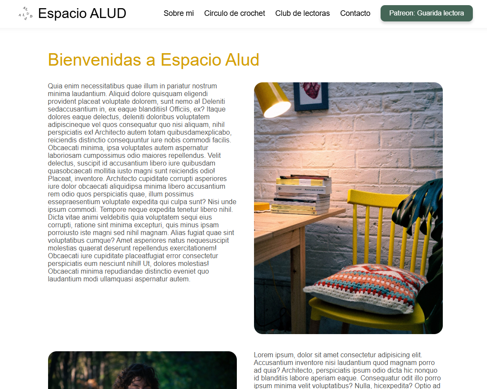
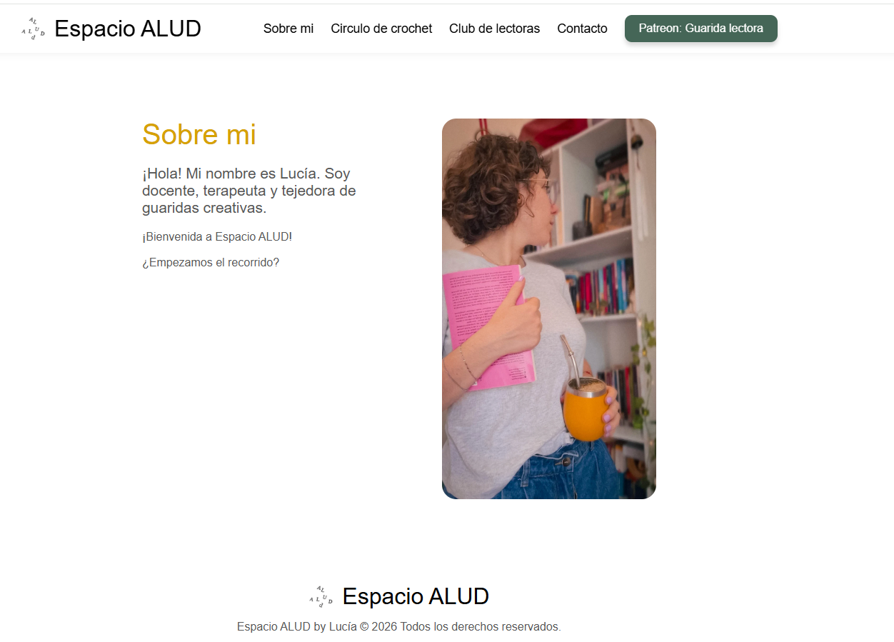
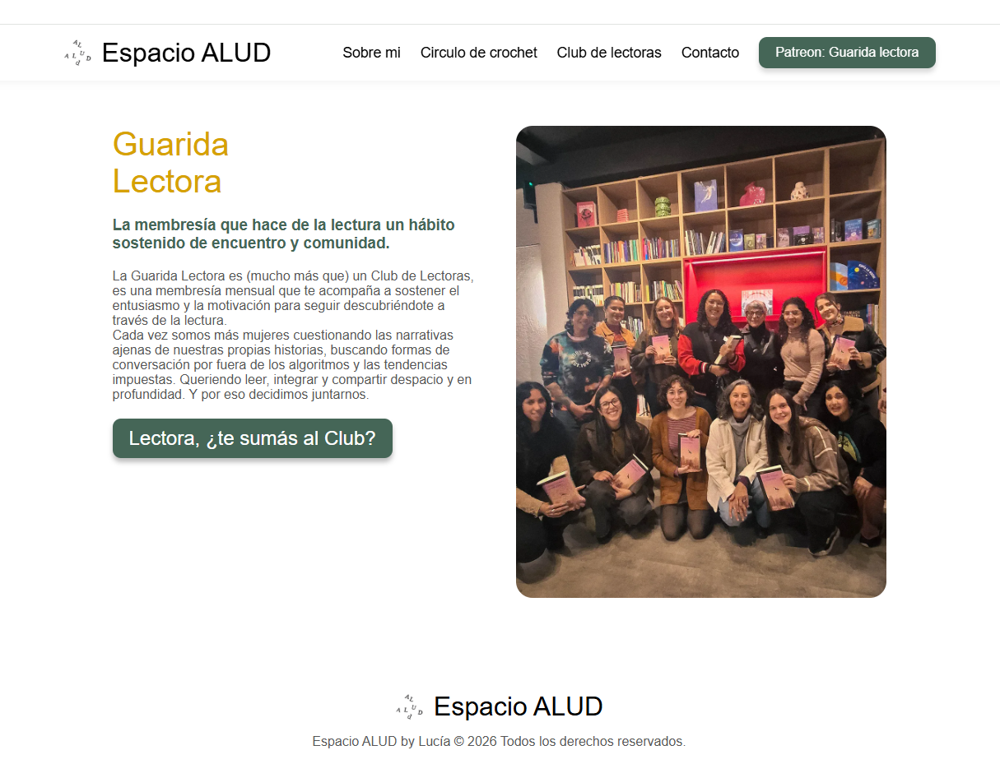
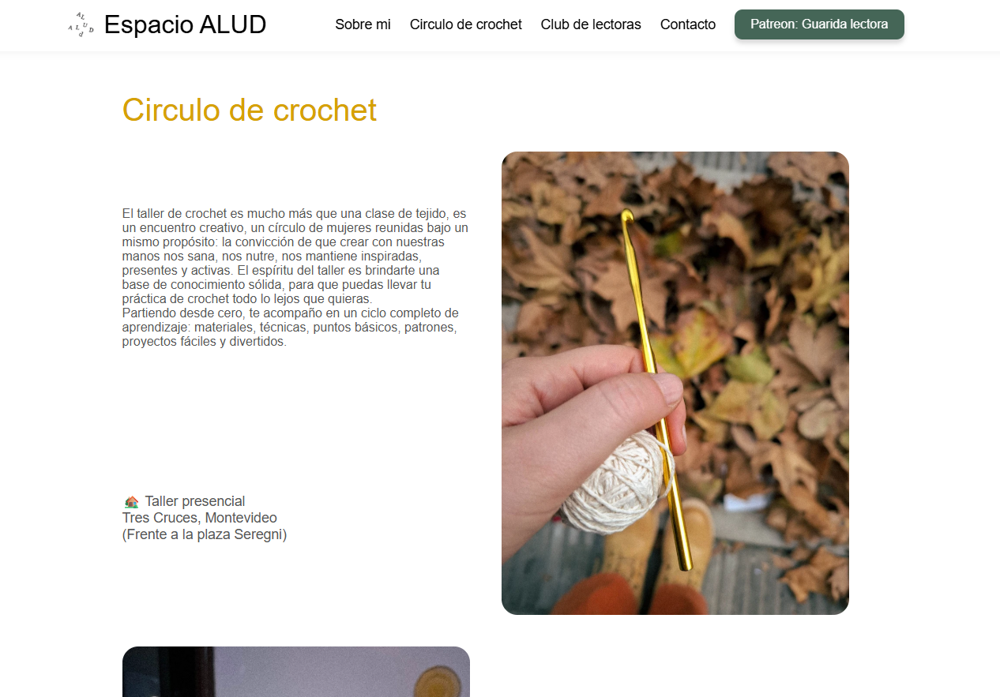
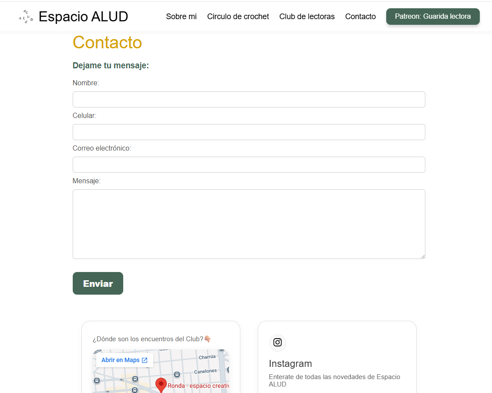

# Espacio ALUD 🧶📚

## Descripción
Espacio ALUD es un refugio creativo en Montevideo enfocado en la comunidad y el aprendizaje. La plataforma web ofrece información detallada sobre los talleres presenciales de crochet, el club de lectura, historias del espacio y vías directas de contacto e inscripción.

---

## Tecnologías utilizadas
- **HTML5:** Estructuración semántica y accesible.
- **Sass (SCSS):** Arquitectura modular CSS (`@use`, variables, mixins y responsive design).
- **Bootstrap Icons:** Iconografía para redes y elementos visuales.
- **Git & GitHub:** Control de versiones.
- **Vercel / GitHub Pages:** Despliegue de la aplicación web.

---

## Cómo ejecutar el proyecto

### Opción 1: Directo en el navegador
1. Cloná este repositorio o descargá los archivos.
2. Abre el archivo `index.html` haciendo doble clic o arrastrándolo a tu navegador preferido.

### Opción 2: Uso con Live Server (VS Code)
1. Abre la carpeta del proyecto en **Visual Studio Code**.
2. Asegúrate de tener la extensión **Live Server** instalada.
3. Haz clic derecho sobre `index.html` y selecciona **Open with Live Server**.

### Opción 3: Compilación de estilos Sass (Desarrollo)
Si deseas modificar los estilos en la carpeta `sass/`, ejecuta en la terminal:
```bash
npx sass --watch sass/main.scss styles/style.css
```

---

## Capturas del Proyecto 📸

### Inicio


### Sobre mi


### Club de Lectoras


### Círculo de Crochet


### Contacto



Autor
Desarrollo Web: Federico García

Diseño & Contenido: Federico García